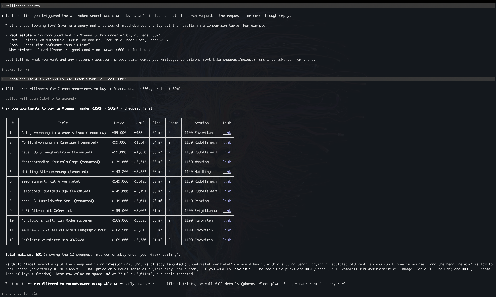
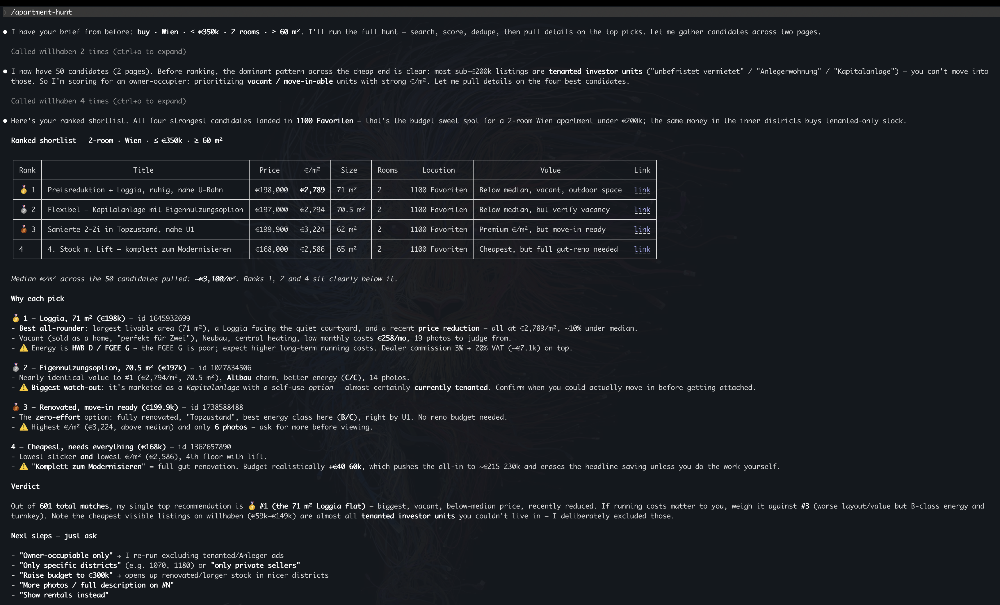

<div align="center">

# willhaben-mcp

**Search Austria's largest classifieds marketplace from any MCP client.**

Browse real estate, cars, jobs, and second-hand listings on
[willhaben.at](https://www.willhaben.at) through Claude and other Model Context
Protocol clients — with natural-language search, structured filters, and full
listing details.

[](./LICENSE)
[](https://nodejs.org)
[](https://modelcontextprotocol.io)
[](#legal--responsible-use)

</div>

---

> [!IMPORTANT]
> **Unofficial project — read this first.** `willhaben-mcp` is **not affiliated with,
> authorized by, or endorsed by willhaben.** willhaben's Terms of Use and `robots.txt`
> **prohibit automated access**, and this tool performs automated access. It is provided
> for **personal, non-commercial, educational use only**, with **no warranty**, and **you
> are solely responsible** for how you use it and for complying with willhaben's terms and
> applicable law. See **[Legal & Responsible Use](#legal--responsible-use)** and
> [`DISCLAIMER.md`](./DISCLAIMER.md). This is not legal advice.

---

## Contents

- [What you can do](#what-you-can-do)
- [Coverage](#coverage)
- [Requirements](#requirements)
- [Quickstart](#quickstart)
- [Available tools](#available-tools)
- [Sample output](#sample-output)
- [Example prompts](#example-prompts)
- [Bundled command & skill](#bundled-command--skill)
- [Location filtering](#location-filtering)
- [How it works](#how-it-works)
- [Limitations & notes](#limitations--notes)
- [Development](#development)
- [Acknowledgements](#acknowledgements)
- [Legal & responsible use](#legal--responsible-use)
- [License](#license)

## What you can do

- 🔍 **Universal search** across all four verticals from a single tool
- 🏠 **Real estate** — apartments & houses for sale/rent, filtered by price, rooms, area, location
- 🚗 **Cars** — used & new vehicles by make, model, price, year, mileage, fuel, transmission
- 💼 **Jobs** — listings by keyword and job type
- 🛍️ **Marketplace** — second-hand items by keyword, category, condition, price, location
- 📋 **Listing details** — full attributes, images, seller info, address, contact options
- 📍 **Smart location** — Austrian states resolved offline, plus live city / place / postal-code lookup
- ⚡ **Zero configuration** — no API keys, no tokens, no accounts
- 🛡️ **Polite by design** — one-request-at-a-time rate limiting and response caching built in

## Coverage

| Vertical | willhaben section | Approx. live inventory* |
| --- | --- | --- |
| Marketplace | Marktplatz | ~13,000,000 ads |
| Real estate | Immobilien | ~110,000 listings |
| Cars & motor | Auto & Motor | ~200,000 vehicles |
| Jobs | Jobs | ~15,000 openings |

<sub>*Approximate, fetched live from willhaben at the time of writing; the real numbers move daily.</sub>

## Requirements

- **Node.js ≥ 18** (uses the built-in global `fetch`)
- Any MCP-compatible client (Claude Desktop, Claude Code, etc.)

## Quickstart

Run directly with `npx` (nothing to install):

```bash
npx willhaben-mcp
```

…or install globally:

```bash
npm install -g willhaben-mcp
willhaben-mcp
```

### Register it with your MCP client

Add to your MCP config (e.g. `claude_desktop_config.json`):

```json
{
  "mcpServers": {
    "willhaben": {
      "command": "npx",
      "args": ["-y", "willhaben-mcp"]
    }
  }
}
```

Or, if you've cloned the repo and built it locally (`npm run build`), point the client at
the bundled `dist/index.js`. Replace `<project-root>` with the absolute path to your clone:

```json
{
  "mcpServers": {
    "willhaben": {
      "command": "node",
      "args": ["<project-root>/dist/index.js"]
    }
  }
}
```

Then restart the client and ask something like *"find 3-room apartments for sale in Graz
under €400,000."* The server speaks MCP over stdio — no ports, keys, or accounts.

## Available tools

| Tool | Purpose |
| --- | --- |
| `willhaben_search` | Universal search across any vertical |
| `willhaben_search_real_estate` | Apartments & houses (buy/rent) with property filters |
| `willhaben_search_cars` | Used/new cars with vehicle filters |
| `willhaben_search_jobs` | Job listings |
| `willhaben_search_marketplace` | Second-hand marketplace items |
| `willhaben_get_listing` | Full detail for a single listing by ID |
| `willhaben_get_categories` | Available category paths per vertical |

<details>
<summary><b>Parameter reference</b></summary>

Common to every search tool: `rows` (default 30, **capped at 100**) and `page` (default 1).

### `willhaben_search`
- `vertical` *(required)* — `marketplace` · `real_estate` · `cars` · `jobs`
- `keyword`, `category`, `location`, `price_from`, `price_to`, `sort`

### `willhaben_search_real_estate`
- `property_type` — `eigentumswohnung` · `haus` · `mietwohnung` · `grundstueck` · …
- `action` — `buy` · `rent`
- `location`, `price_from`, `price_to`, `rooms`, `area_from`, `area_to`, `sort`

### `willhaben_search_cars`
- `make`, `model` *(matched as keywords; a numeric willhaben make/model ID is used directly)*
- `location`, `price_from`, `price_to`, `year_from`, `year_to`, `mileage_from`, `mileage_to`
- `fuel_type` — `petrol` · `diesel` · `electric` · `hybrid_petrol` · `hybrid_diesel`
- `transmission` — `manual` · `automatic`
- `condition` — `used` · `new` · `year_old`
- `sort`

### `willhaben_search_jobs`
- `keyword` *(include a place name here for location, e.g. `"Software Wien"`)*
- `job_type` — `Vollzeit` · `Teilzeit` · …
- `sort`

### `willhaben_search_marketplace`
- `keyword`, `category`, `condition` (`neu`/`gebraucht`/`defekt`), `location`, `price_from`, `price_to`, `sort`

### `willhaben_get_listing`
- `id` *(required)* — the listing/ad ID, e.g. `1370327604`

### `willhaben_get_categories`
- `vertical` *(required)* — `marketplace` · `real_estate` · `cars` · `jobs`

#### Sort values

| `sort` | Meaning | Verticals |
| --- | --- | --- |
| `newest` | Most recent first | all |
| `relevance` | willhaben relevance | all |
| `price_asc` / `price_desc` | Price ↑ / ↓ | real estate, cars, marketplace |
| `nearby` | Distance ↑ | all |
| `area_asc` / `area_desc` | Living area ↑ / ↓ | real estate |
| `mileage_asc` / `mileage_desc` | Mileage ↑ / ↓ | cars |
| `year_asc` / `year_desc` | Registration year ↑ / ↓ | cars |

</details>

## Sample output

A real-estate search returns a compact, scannable summary (truncated):

```text
## Search Results: Eigentumswohnung
Found 333 listings (showing 3 of 3 per page, page 1)
Vertical: real_estate

1. Exklusives Wohnen in Graz-Eggenberg – moderne 2-Zimmer-Wohnung mit Loggia
   💰 € 185.000 | 📍 Graz, Eggenberg | 📐 63 m² | 🛏️ 2 rooms | 📊 € 2.936,51 /m²
   👤 Private | 🔗 https://www.willhaben.at/iad/immobilien/d/eigentumswohnung/...

2. …
```

`willhaben_get_listing` expands one ad into description highlights, full attribute list,
image count, seller (private/dealer), address, and contact option.

## Example prompts

```text
Find 3-room apartments for sale in Graz under €400,000
Search used BMW under €15,000, automatic, registered after 2018
Show new iPhones on the marketplace in Vienna under €700
Get the full details for willhaben listing 1370327604
```

## Bundled command & skill

The repo ships two optional Claude Code extras in [`.claude/`](./.claude) that build on
the MCP tools:

- **`/willhaben-search` command** — turns a one-line query ("2-room flat in Graz under
  300k", "used BMW diesel automatic under 15k") into the right tool call and returns a clean
  comparison table with value metrics (€/m², €/km), locations, and links.

  

- **`apartment-hunt` skill** — a multi-step real-estate workflow: search → score by value →
  dedupe → pull details on the top matches → ranked shortlist with rationale. Trigger it by
  asking to find/compare apartments or houses (e.g. *"help me find a 2-bedroom flat in Vienna
  under €350k"*).

  

They're auto-discovered when you work inside this project. To use them **globally**, copy
them into your user config:

```bash
cp .claude/commands/willhaben-search.md ~/.claude/commands/
cp -r .claude/skills/apartment-hunt ~/.claude/skills/
```

> Both assume the MCP server is registered under the name `willhaben` (as in the config
> above). If you name it differently, update the `allowed-tools` prefix in the command.

## Location filtering

Real-estate, car, and marketplace searches accept a `location` parameter resolved to a
willhaben area in three tiers:

| Input | Example | Resolution |
| --- | --- | --- |
| Austrian state | `Wien`, `Steiermark`, `Tirol` | Instant, offline |
| City / place / postal code | `Graz`, `Innsbruck`, `6020` | Live via willhaben's area autocomplete |
| Numeric area ID | `900` | Passed through directly |

> Location filtering is **not** available for jobs (the jobs API does not support it).
> Put the place name in the job `keyword` instead (e.g. `"Software Wien"`).

## How it works

The server fetches public willhaben.at pages and reads the structured JSON that the site
embeds in its `__NEXT_DATA__` script tag — the same data the willhaben web app renders
from. Jobs use the public `publicapi.willhaben.at` endpoint, and location names are
resolved through willhaben's public area-autocomplete endpoint. No API keys, tokens, or
reverse-engineered credentials are involved.

```text
┌───────────────┐     ┌──────────────────┐     ┌────────────────────────┐
│   MCP client  │ ──▶ │   willhaben-mcp  │ ──▶ │  willhaben.at (public  │
│ (Claude, …)   │     │   (Node.js)      │     │  pages + public APIs)  │
└───────────────┘     └──────────────────┘     └────────────────────────┘
                            │  • __NEXT_DATA__ extraction (cheerio)
                            │  • publicapi.willhaben.at (jobs)
                            │  • /webapi/autocomplete/area (location)
                            │  • rate limit: 1 request/sec · 5-min response cache
```

## Limitations & notes

- **Project / Bauträger ads** (new developments) can appear in real-estate results even
  above your `price_to`, because willhaben surfaces them as teasers; the result count still
  reflects the filter, and per-unit ads respect it.
- **Car make/model** are matched as free-text keywords unless you pass a **numeric willhaben
  make/model ID**. Brand names work well as keywords; exact model-ID filtering needs the ID.
- **Jobs** don't support `location` filtering (the public jobs API ignores it) — fold the
  place into the `keyword`.
- **Dynamic location lookup** (cities/postal codes) makes one extra network call to willhaben's
  area-autocomplete; Austrian state names resolve offline with no extra request.
- **Results are capped at 100 per page.** This is a deliberate, polite default — don't work
  around it to bulk-harvest.
- willhaben's page structure can change at any time; if extraction breaks, the tool returns a
  clear error rather than guessing.

## Development

```bash
npm install          # install dependencies
npm run build        # bundle to dist/ (tsup)
npm run dev          # run from source (tsx)

npx tsx test/integration.test.ts   # smoke test across verticals
npx tsx test/filters.test.ts       # verify every filter end-to-end
```

```text
src/
├── index.ts            # MCP server + tool definitions
├── api/
│   ├── scraper.ts      # __NEXT_DATA__ extraction, rate limit, cache
│   ├── search.ts       # search across real estate / cars / marketplace
│   ├── jobs.ts         # jobs via publicapi.willhaben.at
│   ├── detail.ts       # single-listing detail
│   ├── geo.ts          # location → areaId resolution (static + live)
│   └── types.ts        # willhaben response & tool I/O types
└── utils/
    ├── constants.ts    # verticals, URL patterns, sort codes, area IDs
    └── formatters.ts   # human-readable result formatting
```

## Acknowledgements

A heartfelt **thank-you to [willhaben](https://www.willhaben.at)** — Austria's #1
marketplace and one of the country's most-loved digital products. Every day, millions of
people across Austria rely on willhaben to buy and sell, find a home, land a job, and give
things a second life. This project exists only because willhaben built something genuinely
useful, trusted, and woven into everyday Austrian life. 🇦🇹

All listings, data, content, and trademarks belong to willhaben and its users; this tool
simply offers an individual a convenient way to browse the **public** site. We have deep
respect for willhaben's work — and for their right to decide how their platform is accessed.
If willhaben would prefer this project change or stop, please reach out (see
[`DISCLAIMER.md`](./DISCLAIMER.md)) and we'll gladly cooperate.

## Legal & Responsible Use

Please read the full [`DISCLAIMER.md`](./DISCLAIMER.md). In short:

- **Not affiliated with willhaben.** "willhaben" and related marks belong to their owners
  (willhaben internet service GmbH & Co KG) and are used only for identification.
- **willhaben prohibits automated access.** Their `robots.txt` ("It is expressively
  forbidden to use spiders, search robots or other automatic methods to access
  willhaben.at") and their Terms of Use forbid crawler/robot copying of content and
  commercial reuse without prior consent. **This tool performs automated access; a
  disclaimer does not make that access authorized.**
- **You are responsible.** By using this software you accept sole responsibility for
  complying with willhaben's Terms of Use and `robots.txt`, and with applicable law —
  which may include Austrian/EU unfair-competition (UWG), copyright and **database
  rights**, and **GDPR** (listings can contain personal data).
- **Personal & non-commercial only.** Do not use it for commercial exploitation, bulk
  harvesting, redistributing willhaben data, or contacting advertisers at scale. For
  anything beyond personal use, seek **written permission / an official feed from
  willhaben**.
- **No warranty, no liability.** Provided "AS IS" — see [`LICENSE`](./LICENSE).
- **Be polite.** The built-in rate limit and cache exist to minimize load; don't remove
  or aggressively raise them.

This project is not legal advice. If in doubt, consult a qualified lawyer and/or contact
willhaben.

## License

[MIT](./LICENSE) © Ali Ildan. The MIT license covers this software only; it grants no
rights to willhaben's content, data, trademarks, or services.
